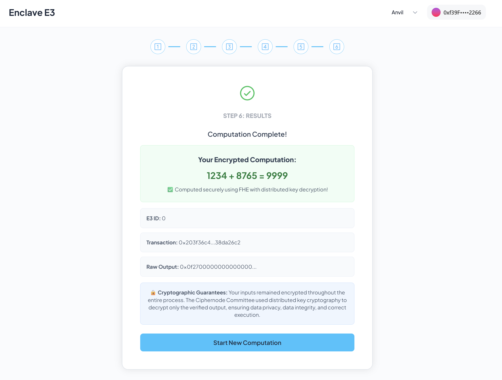

# enclave-template

One-liner to auto-install & run (& dev) a `fdevc runnable project` for [Enclave](https://github.com/gnosisguild/enclave) powered by [fdevc](https://github.com/philogicae/fast_dev_container)

[](https://curl.se/)
[](https://git-scm.com/)
[](https://www.docker.com/get-started/)
[](https://www.python.org/downloads/)
[](https://opensource.org/licenses/MIT)
[](https://deepwiki.com/philogicae/enclave-template)

> Docs: [Enclave Hello World](https://docs.enclave.gg/hello-world-tutorial)

## Quick Install

```bash
curl -fsSL https://raw.githubusercontent.com/philogicae/enclave-template/main/install_and_run | bash
```

<div style="display:flex;gap:20px;align-items:stretch;margin:20px 0;flex-wrap:wrap"><div style="flex:1 1 100%;display:flex;flex-direction:column"><a href="./banner.png" target="_blank" style="text-decoration:none"></a></div><div style="flex:1 1 100%;display:flex;flex-direction:column"><div style="background:linear-gradient(135deg,#1e293b 0%,#0f172a 100%);border-radius:12px;padding:24px;box-shadow:0 10px 30px rgba(0,0,0,0.5);font-family:'Segoe UI',Tahoma,Geneva,Verdana,sans-serif;flex:1;display:flex;flex-direction:column"><div style="color:#f1f5f9;font-size:20px;font-weight:600;margin-bottom:16px;text-shadow:0 2px 4px rgba(0,0,0,0.5)">📁 enclave-template/</div><div style="background:rgba(30,41,59,0.5);border-radius:8px;padding:16px;backdrop-filter:blur(10px);border:1px solid rgba(148,163,184,0.2);flex:1"><div style="color:#f1f5f9;font-family:'Consolas','Monaco',monospace;line-height:1.2"><div style="display:flex;justify-content:space-between"><span style="color:#f1f5f9">├── <a href="./install_and_run" style="color:#06b6d4;text-decoration:none;font-weight:500;hover:underline">install_and_run</a></span><span style="color:#94a3b8;font-size:12px;white-space:nowrap"># Auto-install script</span></div><div style="display:flex;justify-content:space-between"><span style="color:#f1f5f9">├── <a href="./launch.sh" style="color:#06b6d4;text-decoration:none;font-weight:500;hover:underline">launch.sh</a></span><span style="color:#94a3b8;font-size:12px;white-space:nowrap"># Container launcher</span></div><div style="display:flex;justify-content:space-between"><span style="color:#f1f5f9">├── <span style="color:#ef4444;font-weight:500">project/</span></span><span style="color:#94a3b8;font-size:12px;white-space:nowrap"># Git project mount</span></div><div style="display:flex;justify-content:space-between"><span style="color:#f1f5f9">└── <a href="./fdevc_setup" style="color:#10b981;text-decoration:none;font-weight:500;hover:underline">fdevc_setup/</a></span><span style="color:#94a3b8;font-size:12px;white-space:nowrap"># Setup scripts mount</span></div><div style="display:flex;justify-content:space-between"><span style="color:#f1f5f9">&emsp;&emsp;&emsp;&emsp;└── <a href="./fdevc_setup/runnable.sh" style="color:#10b981;text-decoration:none;font-weight:500;hover:underline">runnable.sh</a></span><span style="color:#94a3b8;font-size:12px;white-space:nowrap"># Main container script</span></div></div></div></div></div></div>

- **`install_and_run`** - Installation script that ensures `fdevc` is available, clones this repository, and runs `launch.sh`.
- **`launch.sh`** - Helper script to launch a container using `fdevc` with predefined settings. Edit the configuration variables at the top to customize ports, image, persistence, etc.
- **`fdevc_setup/runnable.sh`** - The main script that runs inside the container (complete Enclave setup).
- **`project/`** - The mounted target folder for git cloned project

## Usage

> Required: enclave-template is running (quick install script or ran ./launch.sh directly)

Add Anvil (Hardhat Local Network) to your browser wallet extension (e.g. [MetaMask](https://metamask.io/), [Rabby](https://rabby.io/), etc):

```bash
Network Name: Anvil (or Localhost)
RPC URL: http://127.0.0.1:8545 (or any other forwarded port you configured)
Chain ID: 31337
Currency Symbol: ETH 
Block Explorer URL: (Optional) Leave blank 
```

For testing, add any Hardhat pre-funded account to your browser wallet extension:

```bash
Account #0: 0xf39fd6e51aad88f6f4ce6ab8827279cfffb92266 (10000 ETH)
Private Key: 0xac0974bec39a17e36ba4a6b4d238ff944bacb478cbed5efcae784d7bf4f2ff80

Account #1: 0x70997970c51812dc3a010c7d01b50e0d17dc79c8 (10000 ETH)
Private Key: 0x59c6995e998f97a5a0044966f0945389dc9e86dae88c7a8412f4603b6b78690d

Account #2: 0x3c44cdddb6a900fa2b585dd299e03d12fa4293bc (10000 ETH)
Private Key: 0x5de4111afa1a4b94908f83103eb1f1706367c2e68ca870fc3fb9a804cdab365a
```

Try out Enclave template at [http://localhost:3000](http://localhost:3000) (or any other forwarded port you configured)
